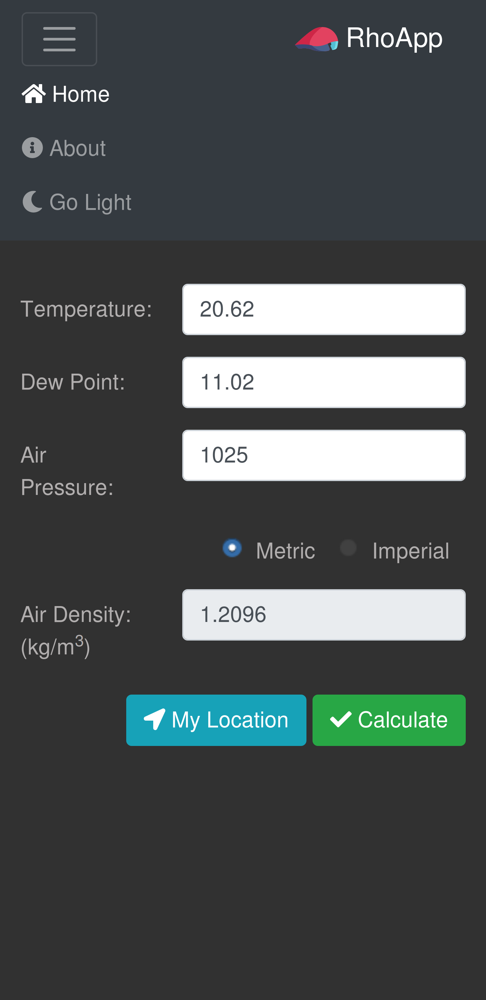

# RhoApp

Calculate air density (rho) based on air temperature, pressure and relative humidity (RH). 

I've built this as a fun way to brush up on Javascript, learn Vue.Js and lay the foundation for a future project dealing with computation of coeficient of drag (CdA) in cycling based on field testing data using the Chung / Virtual Elevation method with Rho (air density) being one of the inputs required to estimate CdA.

For more on R. Chung's Virtual Elevation method click [here](http://anonymous.coward.free.fr/wattage/cda/indirect-cda.pdf).

## Features

* Calculate Rho (air density) based on manually entered temperature, dew point and air pressure
* Support for Imperial and Metric units and units conversion
* Support for automatic data input based on current location combined with [OpenWeatherMap](https://home.openweathermap.org) data. This is pretty handy when field testing and processing data on site.
* Dark mode / light mode switching with dark mode enabled by default


<center></center>

## TODO

* Support weather data pull by Zip Code and Latitude / Longitude coordinates

## Build Setup

``` bash
# install dependencies
npm install

# serve with hot reload at localhost:8080
npm run dev

# build for production with minification
npm run build

# build for production and view the bundle analyzer report
npm run build --report
```

For a detailed explanation on how things work, check out the [guide](http://vuejs-templates.github.io/webpack/) and [docs for vue-loader](http://vuejs.github.io/vue-loader).


## Configuration

In order to use the location based weather data pull you need to configure your app instance to connect to the OpenWeatherMap API. To do so follow these simple steps:

* Sample application configuration files are provided in the *config* folder. Rename *sample.dev.env.js* to *dev.env.js* and *sample.prod.env.js* to *prod.env.js*.
* Sign up for a free **OpenWeatherMap** account at https://openweathermap.org/api
* Once your account is set up, go into [API Keys](https://home.openweathermap.org/api_keys) and copy your API key.
* Configure **RhoApp** by editing the *config/prov.env.js* or *config/dev/env.js* files and inserting the API key copied in the previous text into the placeholder.

## History

Initial version launched on December 23, 2018.

## Contributing
1. Fork it!
2. Create your feature branch: `git checkout -b my-new-feature`
3. Commit your changes: `git commit -am 'Add some feature'`
4. Push to the branch: `git push origin my-new-feature`
5. Submit a pull request :D

## License

MIT